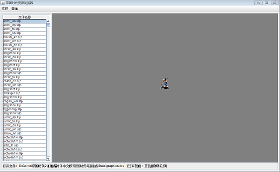
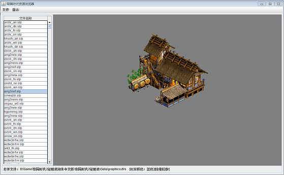

aoe_viewer
==========

一个简单的查看《帝国时代2》游戏资源的工具，主要是为了展示我写的 game_archive 库的效果。

使用前先签出 https://github.com/bookong/game_archive.git 进行构建。

然后构建本项目，将构建后的 aoe_viewer.jar 拷贝到 release 下

然后执行 copy_lib.bat 拷贝相关的 lib 到 release\lib 路径下。

执行 runw.bat 运行程序。

